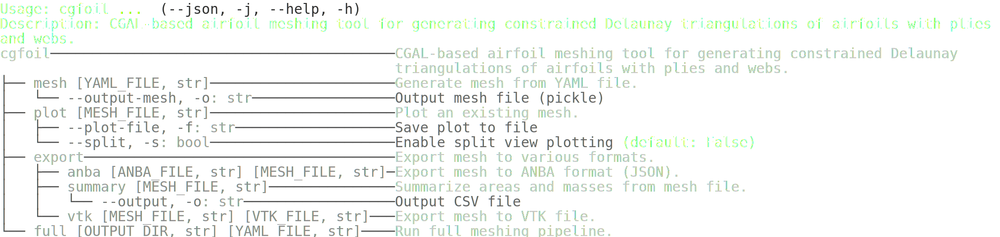
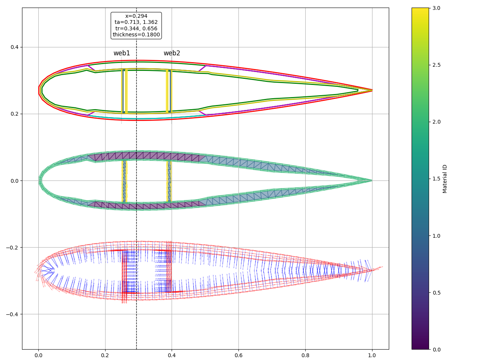

# cgfoil

A CGAL-based airfoil meshing tool for generating constrained Delaunay triangulations of airfoils with plies and webs.

## Installation

Install with uv:

```bash
uv pip install .
```

## Usage

### CLI help




Generate mesh from YAML:

```bash
cgfoil mesh examples/airfoil_mesh.yaml -o mesh.pkl
```

Plot existing mesh:

```bash
cgfoil plot mesh.pkl --plot-file plot.png
```

Export to VTK:

```bash
cgfoil export vtk mesh.pkl output.vtk
```

Export to ANBA:

```bash
cgfoil export anba mesh.pkl output.json
```

Run with defaults:

```bash
cgfoil run --plot --vtk output.vtk
```

Options:
- `-p, --plot`: Plot the triangulation
- `-v, --vtk FILE`: Output VTK file
- `-f, --file FILE`: Path to airfoil data file (.dat), default: naca0018.dat
- `-s, --split`: Enable split view plotting
- `--plot-file FILE`: Save plot to file

## Examples

See the `examples/` directory for programmatic usage, including loading from YAML.


## Example output
Example output 


## Development

Use uv for dependency management:

```bash
uv sync
```

Run tests:

```bash
uv run pytest
```

Format code:

```bash
uv run ruff format
```

Lint:

```bash
uv run ruff check
```